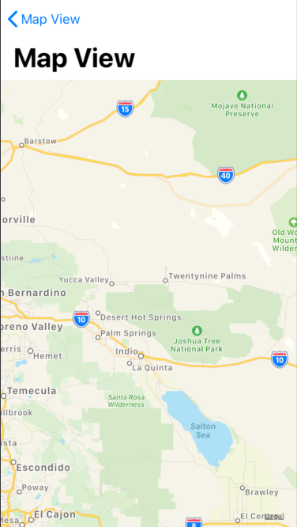

# Easy Map View

An easy map view written in SwiftUI, utilizing XCode Playgrounds.
Clicking on the "Play Button" (a provided system image) will navigate to the detail screen.

### Initial Map View


### Map Detail View


### Code

Because there's so little code, I'm providing it in this readme! It's also viewable within the ContentView.swift file

```swift
import SwiftUI
import PlaygroundSupport
import MapKit


// Root view
struct ContentView : View {
	var body : some View {
		NavigationView {
			MapView()
				.frame(height: 200)
			
			ImageView()
				.navigationBarTitle(Text("Detail View"))
				.navigationBarHidden(true)
			
			DescriptionView()
			Spacer()
		}
	}
}


// Map View
struct MapView: UIViewRepresentable {
	func makeUIView(context: Context) -> MKMapView {
		MKMapView(frame: .zero)
	}
	
	func updateUIView(_ view: MKMapView, context: Context) {
		let coordinate = CLLocationCoordinate2D(
			latitude: 34.011286, longitude: -116.166868)
		let span = MKCoordinateSpan(latitudeDelta: 2.0, longitudeDelta: 2.0)
		let region = MKCoordinateRegion(center: coordinate, span: span)
		view.setRegion(region, animated: true)
	}
}


// Image View
struct ImageView : View {
	var body: some View {
		NavigationButton(destination: MapView().navigationBarTitle(Text("Map View"))) {
			Image(systemName: "play.circle")
				.resizable()
				.foregroundColor(.black)
				.frame(width: 200, height: 200)
				.offset(y: -110)
				.padding(.bottom, -100)
		}
	}
}


// Description View
struct DescriptionView : View {
	var body: some View {
		Text("Lorem ipsum dolor sit amet, consectetur adipiscing elit, sed do eiusmod tempor incididunt ut labore et dolore magna aliqua. Ut enim ad minim veniam, quis nostrud exercitation ullamco laboris nisi ut aliquip ex ea commodo consequat. Duis aute irure dolor in reprehenderit in voluptate velit esse cillum dolore eu fugiat nulla pariatur. Excepteur sint occaecat cupidatat non proident, sunt in culpa qui officia deserunt mollit anim id est laborum.")
			.lineLimit(nil)
			.padding(.horizontal, 20)
	}
}


// Present the view controller in the Live View window
PlaygroundPage.current.liveView = UIHostingController(rootView: ContentView())
```